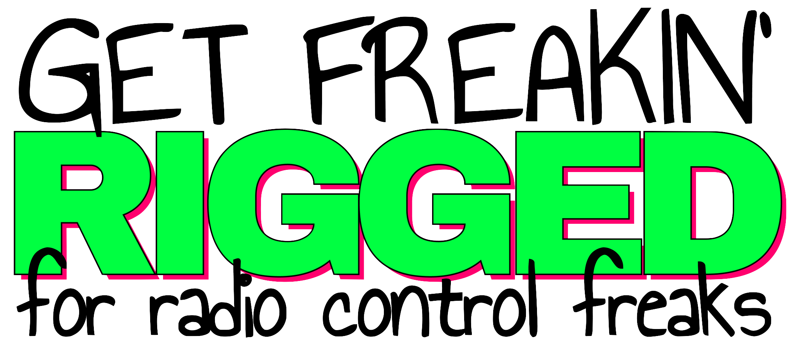

  <picture>
    <source media="(prefers-color-scheme: light)" srcset="assets/logo-dark.png">
    
  </picture>

<strong>One window. Every mode. No WSJT-X.</strong>

---

Ham radio software stops being eight programs in a trench coat. Rigged runs FT8, CW, the keyer, the logbook, the audio path, the works — one window, any OS, any radio your driver supports. No Hamlib config. No virtual audio cables. No tabbing between four apps to make one QSO.

This repo is the public face. Source is private.

---

## What it replaces

| You currently run | Rigged ships built in |
|---|---|
| WSJT-X / JTDX | Pure Java FT8, FT4, JT65, WSPR decoder (16 digital modes) |
| flrig / rigctld / Hamlib | Direct CAT control + Hamlib emulation for legacy apps |
| Log4OM / N1MM+ / Logger32 | QSO log with QRZ + LoTW upload |
| VAC / BlackHole / VB-Cable | Direct USB audio + TCP streaming |
| fldigi / Winlink | Built-in digital modes + Winlink P2P |
| Separate contest loggers | Contest profiles with rate tracking and dupe checking |

---

## What works today

Current version: **1.1.175**. Mac, Windows, and Linux native packages plus a web client that runs in any modern browser.

- **Profiles and drag-and-drop UI.** Eleven profiles ship in the box — Digital, CW, POTA, Contest, DX, Ragchew, Emcomm, Net, Satellite, WSPR, Default. Three views per profile by default; rename, duplicate, delete, build your own. Every panel drops onto any view.
- **FTX-1 driver.** 91 CAT commands, 17 operating modes, every menu setting. Hardware-verified on Field, Optima, and SPA-1 heads.
- **Native digital modes.** FT8, FT4, JT65, WSPR decoded server-side, pure Java. Remote sessions don't break decode timing.
- **Local and remote, same app.** Audio over TCP. One installer, one flag — server, client, or both.
- **Hamlib bridge.** rigctld emulation on port 4532 keeps WSJT-X, fldigi, and the rest happy while you migrate.
- **Nine languages.** English, German, French, Spanish, Italian, Japanese, Russian, Hebrew, Arabic (RTL).
- **2,500+ tests** across CAT (265), net-audio (73), Hamlib emulation (57), digital decoder (1,418), and frontend (750+).

---

## What's broken right now

Honest version. Filed and not-yet-filed.

**Hamvention-surfaced (active fix queue):**

- **Stuck-on-air PTT.** Radio occasionally stays keyed after release; recovery needs a power cycle. Cross-platform. First priority.
- **Audio waterfall hiccups.** Roughly 1 Hz silence pattern during remote streaming.
- **Radio-connect plugin auto-flips to RPC** after local disconnect. Operator-confusing during demos.
- **Sidebar slow to sync** on Windows remote — UI appears blocked until it catches up.

**Filed bugs:**

- Winlink UI rough edges: silent failure on bad callsign (#117), "sent" status while the message is still queued (#116), Retry button next to a new-compose after failure (#119), outbox vanishes on new compose (#118), auth-failed toast clears too fast (#121), Send-failed banner with no reason (#122).
- `bump-version.sh` script: leaves submodule files dirty (#153), locale-check false positive (#138), occasionally empties plugin `pom.xml` (#137).
- Daylight theme: `btn-primary` renders green-ish, not cyan (#67).

---

## What we just shipped

Last thirty days, structural — boring but necessary:

- **Connection-state source-of-truth refactor**, phases 1–5 of 6. Sidebar dot, plugin status, and backend state now all read from the same place instead of three.
- **CAT-RPC subsystem hardening.** Closed an audio-query proxy gap (#144), added a loop-prevention gate (#145), Phase 2 cleanup (#146, #147).
- **Cross-session relay protocol.** Formalized clock-skew handling, mid-flight question mode, and stale-inbox audits between sandbox and host helpers.
- **DiscoveryServer multi-homed IP fix** (#150). **Sidebar Reconnect button rendering** (#143). **AudioRecorder canonical-path bug** under user data.
- **`bump-version.sh` repairs** — BSD-sed quirks (#137 partial), locale-range check (#138), version-marker re-deploy gate (#139).

Currently in a feature freeze for the post-Hamvention cleanup sprint. No new features land until the four Hamvention-surfaced bugs above smoke green.

---

## What's coming next

**Active sprint:**

- Phase 6 of the connection-state refactor — collapse three connect paths into one.
- The four Hamvention-surfaced bugs.
- Backlog triage — every open issue gets a priority label.
- Frontend test rehab: 46 stale failures in 4 files.

**Asked for at Hamvention 2026** (filed, not yet built):

- **JS8 Call** integration for HF text and APRS messaging (#154).
- **iOS / Android** clients for grid-down EmComm — tablets and phones outlast laptops on battery (#155).
- **Public alpha / sandbox build** with mock CAT, so operators without an FTX-1 can evaluate the UX (#156).
- **Mac App Store** distribution alongside direct download (#157).
- **Landing page + early-access list** (#158).

**Longer horizon:**

- Multi-manufacturer drivers. The architecture was built for it; Icom and Kenwood are next candidates.
- Winlink RMS hosting (issues #127–#136) — sitting behind the freeze.
- White-label OEM builds.

---

## Not yet

There's no install, no signup, no buy button — not yet. This repo is a snapshot of where the work is right now, posted while the brand and the website catch up to the software.

Watch the repo, or [follow KJ5HST on GitHub](https://github.com/KJ5HST), for updates.

---

Copyright 2024–2026 Terrell Deppe (KJ5HST). All rights reserved. Source private.
